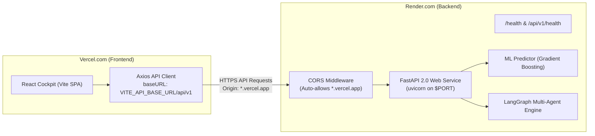

# 🚀 GreenMind AI — Render.com & Vercel.com Deployment & Connection Guide

This guide provides end-to-end instructions for connecting your **FastAPI Backend (deployed on Render.com)** with your **React/Vite Frontend (deployed on Vercel.com)**.

---

## 🏗️ Architecture Overview



---

## ⚡ Step 1: Deploy Backend to Render.com

### Option A: Using `render.yaml` Blueprint (Recommended)
1. Log in to [dashboard.render.com](https://dashboard.render.com).
2. Click **New +** &rarr; **Blueprint**.
3. Connect your repository: `https://github.com/Pratham-stack-coder/GreenMind-AI`.
4. Render detects [`render.yaml`](file:///render.yaml) automatically:
   - **Service Name**: `greenmind-backend`
   - **Environment**: `Python 3.12`
   - **Build Command**: `pip install -r backend/requirements.txt && cd backend/app/ml && python train.py || echo 'ML training failed'`
   - **Start Command**: `python -m uvicorn backend.app.main:app --host 0.0.0.0 --port $PORT`
   - **Health Check Path**: `/health`
5. Click **Apply**.
6. Once deployed, copy your Render Web Service URL:
   ```text
   https://<your-service-name>.onrender.com
   ```

### Option B: Manual Web Service Setup on Render
If setting up manually without Blueprint:
- **Root Directory**: `.` (leave empty or repository root)
- **Runtime**: `Python 3`
- **Build Command**: `pip install -r backend/requirements.txt && cd backend/app/ml && python train.py`
- **Start Command**: `python -m uvicorn backend.app.main:app --host 0.0.0.0 --port $PORT`
- **Health Check Path**: `/health`
- **Environment Variables**:
  - `PYTHONPATH`: `.`
  - `DEMO_MODE`: `true` (or `false` if using live AWS/Azure/GCP credentials)
  - `APP_VERSION`: `2.0.0`
  - `CORS_ORIGINS`: `https://your-frontend.vercel.app` (optional, `*.vercel.app` is already allowed automatically)

---

## 🌐 Step 2: Deploy Frontend to Vercel.com

1. Log in to [vercel.com](https://vercel.com).
2. Click **Add New...** &rarr; **Project**.
3. Import your GitHub repository (`GreenMind-AI`).
4. In the project setup screen:
   - **Framework Preset**: `Vite`
   - **Root Directory**: `.` (or `frontend` if deploying frontend folder directly)
   - **Build Command**: `npm --prefix frontend install && npm --prefix frontend run build` (or `npm run build` if Root Directory is `frontend`)
   - **Output Directory**: `frontend/dist` (or `dist` if Root Directory is `frontend`)
5. Click **Deploy**.

---

## 🔗 Step 3: Connect Frontend to Backend

### A. Set Environment Variable in Vercel
1. Open your project on **Vercel Dashboard**.
2. Navigate to **Settings** &rarr; **Environment Variables**.
3. Add the following variable:
   - **Key**: `VITE_API_BASE_URL`
   - **Value**: `https://<your-service-name>.onrender.com` (your Render URL from Step 1)
   - **Target**: Production, Preview, Development (check all three)
4. Click **Save**.
5. Go to **Deployments** &rarr; click **...** on your latest deployment &rarr; **Redeploy** (required so Vite bakes the `VITE_` env var into the build).

### B. Configure CORS on Render (Automatic & Custom)
- **Automatic**: The backend automatically permits all `https://*.vercel.app` domains out-of-the-box (including production, preview branches, and pull requests).
- **Custom Domains**: If you use a custom domain (e.g. `https://mycustomapp.com`):
  1. Open your Render Web Service dashboard &rarr; **Environment**.
  2. Add / edit:
     - **Key**: `CORS_ORIGINS`
     - **Value**: `https://mycustomapp.com` (comma-separated for multiples)
  3. Click **Save Changes**.

---

## ⚡ Step 4: Instant Runtime Connection in the UI (No Rebuild Needed!)

You don't need to wait for a Vercel rebuild to test or change your backend URL:
1. Open your deployed Vercel application.
2. Navigate to **Settings** (or click the status indicator in the top right bar).
3. Under **FastAPI Backend Connection (Render.com)**:
   - Paste your Render URL: `https://<your-service-name>.onrender.com`
   - Click **Test Connection**: Pings `/health` and measures roundtrip latency.
   - Click **Save & Connect**: Instantly stores the URL in browser local storage and points all API requests to Render without redeploying!

---

## 🔍 Verification & Troubleshooting

### 1. Test Backend Health Directly
Open your browser and visit:
```text
https://<your-service-name>.onrender.com/health
```
Expected JSON response:
```json
{
  "status": "ok",
  "version": "2.0.0",
  "demo_mode": true,
  "cloud_mode": "demo",
  "database": "sqlite",
  "redis": false,
  "llm_configured": false
}
```

### 2. Render Free-Tier Cold Starts (~30–50s delay)
- Render's free tier spins down web services after 15 minutes of inactivity.
- When you first visit the frontend or click *Test Connection*, Render needs **30–50 seconds** to wake up.
- GreenMind AI's API client timeout is configured to **45 seconds** to accommodate cold starts.
- If the first ping times out, wait 15 seconds and click **Test Connection** again.

### 3. URL Normalization
You can enter your URL in any format:
- `https://greenmind-backend.onrender.com` &rarr; normalized to `/api/v1`
- `https://greenmind-backend.onrender.com/` &rarr; trailing slash removed
- `https://greenmind-backend.onrender.com/api/v1` &rarr; duplicate `/api/v1` prevented
