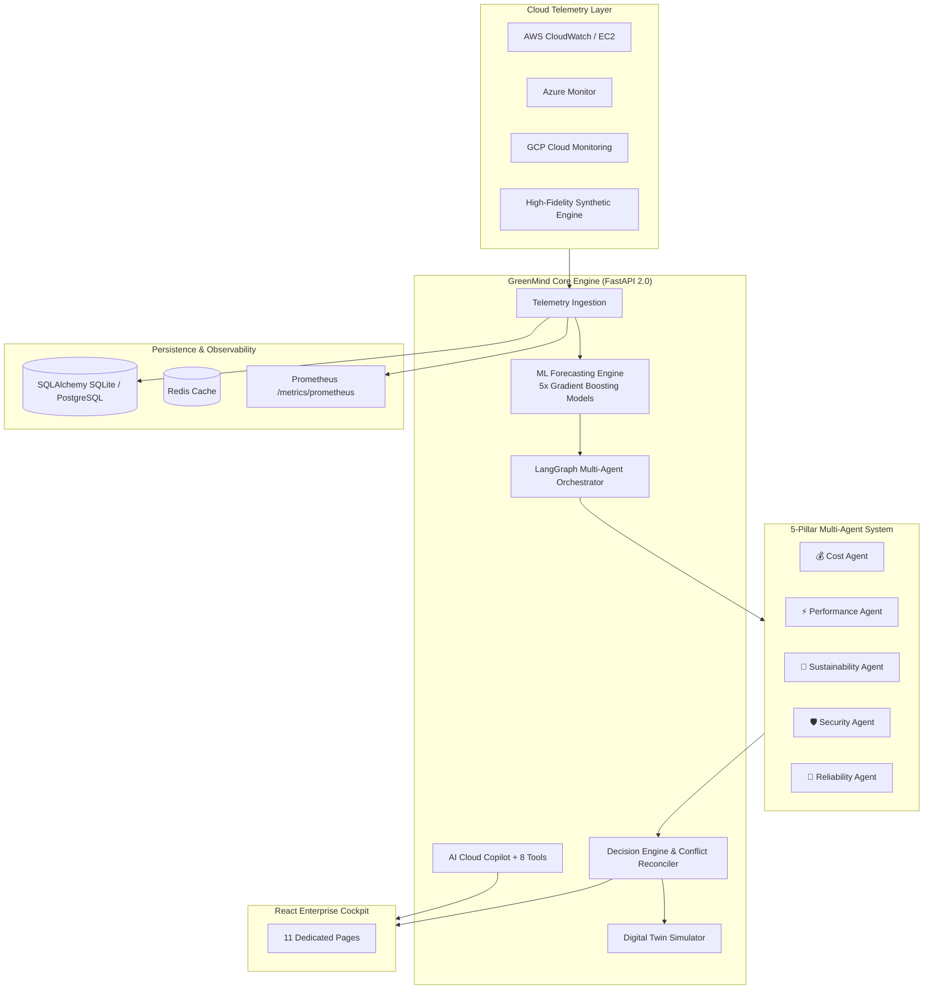

# 🌿 GreenMind AI — Autonomous Green Cloud Operating System

[](https://fastapi.tiangolo.com)
[](https://react.dev)
[](https://vitejs.dev)
[](https://scikit-learn.org)
[](https://github.com/langchain-ai/langgraph)
[](https://www.docker.com)
[](LICENSE)

> **GreenMind AI** is an enterprise-grade Autonomous Green Cloud Operating System designed to monitor, forecast, and optimize multi-cloud infrastructure across **AWS**, **Azure**, and **GCP**.
>
> By uniting **5-metric Machine Learning forecasting**, a **LangGraph-driven multi-agent AI system** with transparent conflict resolution, an infrastructure **Digital Twin simulator**, and an **Explainable AI Copilot**, GreenMind AI empowers engineering and FinOps/GreenOps teams to cut cloud costs and Scope 2 carbon emissions simultaneously.

---

## 📋 Status Breakdown

### 🟢 IMPLEMENTED
- **Zero-Config Demo Mode**: Complete offline functionality with realistic diurnal load patterns and regional carbon curves across 6 power grid regions. Works out of the box with zero external keys.
- **Enterprise Dark React Cockpit (All 11 Dedicated Pages)**:
  1. `Overview Dashboard` ([DashboardPage.tsx](file:///c:/Users/Pratham/dummy/Downloads/GreenMind-AI/GreenMind-AI/frontend/src/pages/DashboardPage.tsx)): 8 metric cards (CPU, Memory, Storage, Network, Cost, Carbon, Cloud Health, Optimization Score), 6 live trend charts (CPU history, Memory history, Cost trend, Carbon trend, Network usage, Predicted CPU), and explicit **`DEMO DATA`** / **`LIVE AWS`** badges.
  2. `Cloud Resources` ([CloudResourcesPage.tsx](file:///c:/Users/Pratham/dummy/Downloads/GreenMind-AI/GreenMind-AI/frontend/src/pages/CloudResourcesPage.tsx)): Searchable multi-cloud resource inventory with right-sizing candidate flags.
  3. `Predictions` ([PredictionsPage.tsx](file:///c:/Users/Pratham/dummy/Downloads/GreenMind-AI/GreenMind-AI/frontend/src/pages/PredictionsPage.tsx)): 60-minute multi-metric forecasting and model evaluation telemetry.
  4. `Cost Optimization` ([CostOptimizationPage.tsx](file:///c:/Users/Pratham/dummy/Downloads/GreenMind-AI/GreenMind-AI/frontend/src/pages/CostOptimizationPage.tsx)): Spend curve, underutilization detection, and instant scenario simulator.
  5. `Carbon Intelligence` ([CarbonIntelligencePage.tsx](file:///c:/Users/Pratham/dummy/Downloads/GreenMind-AI/GreenMind-AI/frontend/src/pages/CarbonIntelligencePage.tsx)): 24-hour grid carbon intensity curve, regional clean energy ranking, and time-shift scheduler.
  6. `AI Recommendations` ([RecommendationsPage.tsx](file:///c:/Users/Pratham/dummy/Downloads/GreenMind-AI/GreenMind-AI/frontend/src/pages/RecommendationsPage.tsx)): Recommendation ledger with Dry-Run, Apply, Rollback, and Explain AI modal.
  7. `Multi-Agent AI` ([AgentsPage.tsx](file:///c:/Users/Pratham/dummy/Downloads/GreenMind-AI/GreenMind-AI/frontend/src/pages/AgentsPage.tsx)): Visual orchestration flow, domain scores, and transparent conflict resolution matrix.
  8. `Digital Twin` ([DigitalTwinPage.tsx](file:///c:/Users/Pratham/dummy/Downloads/GreenMind-AI/GreenMind-AI/frontend/src/pages/DigitalTwinPage.tsx)): Interactive simulation workbench for all 4 scenarios.
  9. `AI Copilot` ([CopilotPage.tsx](file:///c:/Users/Pratham/dummy/Downloads/GreenMind-AI/GreenMind-AI/frontend/src/pages/CopilotPage.tsx)): Natural language interface citing real backend metrics and providing quick actions.
  10. `Analytics` ([AnalyticsPage.tsx](file:///c:/Users/Pratham/dummy/Downloads/GreenMind-AI/GreenMind-AI/frontend/src/pages/AnalyticsPage.tsx)): Historical spend and carbon analytics with provider breakdowns.
  11. `Settings` ([SettingsPage.tsx](file:///c:/Users/Pratham/dummy/Downloads/GreenMind-AI/GreenMind-AI/frontend/src/pages/SettingsPage.tsx)): Cloud mode switcher, provider selector, and backend/database/Redis/LLM connectivity health checks.
- **5-Metric ML Forecasting Pipeline**: Separate Gradient Boosting models for CPU, Memory, Network, Cost, and Carbon. Chronological train/test split without data leakage. Real MAE, RMSE, and R² scores recorded and exported.
- **Explainable AI (XAI)**: Every recommendation provides What Detected, Why It Matters, Evidence, Recommendation, Expected Impact, and real ML Feature Importance (`feature_importance.json`).
- **LangGraph Multi-Agent Architecture with Conflict Resolution**: 5 specialized agents (Cost, Performance, Sustainability, Security, Reliability) with explicit transparent conflict resolution (`resolve_conflicts()`).
- **Digital Twin Simulation Engine**: Non-destructive simulator evaluating Before vs After for `RIGHT_SIZE`, `SCALE_UP`, `SCALE_DOWN`, and `CONSOLIDATE`. Labeled `SIMULATED / ESTIMATED`.
- **AI Cloud Copilot Engine**: Natural language query processing grounded in 8 tools (`get_cloud_metrics`, `get_history`, `get_predictions`, `get_cost_analysis`, `get_carbon_analysis`, `get_recommendations`, `get_cloud_health`, `run_digital_twin_simulation`). Cites data sources without hallucinating.
- **Database & Persistence**: Async SQLAlchemy ORM supporting both SQLite (`greenmind.db`) for demo/dev and PostgreSQL for production. Optional Redis caching.
- **Prometheus Monitoring & Observability**: Middleware & exposition at `/metrics/prometheus` tracking request rates, latencies, prediction counts, errors, and agent execution times. Grafana dashboard JSON provided.
- **Unified Clean API Router**: Complete root and `/api/v1/` routes preserving all legacy and existing endpoints.

---

### 🟡 PARTIALLY IMPLEMENTED
- **Azure & GCP Provider Adapters**: Clean provider interfaces ([azure_provider.py](file:///c:/Users/Pratham/dummy/Downloads/GreenMind-AI/GreenMind-AI/backend/app/cloud/azure_provider.py), [gcp_provider.py](file:///c:/Users/Pratham/dummy/Downloads/GreenMind-AI/GreenMind-AI/backend/app/cloud/gcp_provider.py)) and demo adapters are implemented. Live metric collection hooks are prepared for Azure Monitor and Google Cloud Monitoring APIs when credentials are configured.

---

### 🔑 OPTIONAL / REQUIRES CREDENTIALS
- **AWS Live Telemetry**: Live AWS CloudWatch collector ([aws_collector.py](file:///c:/Users/Pratham/dummy/Downloads/GreenMind-AI/GreenMind-AI/backend/app/services/aws_collector.py)) uses `boto3` for EC2 `CPUUtilization`, `NetworkIn`, and `NetworkOut`. Requires `AWS_ACCESS_KEY_ID` and `AWS_SECRET_ACCESS_KEY`.
  - *Note on Memory & Disk*: Standard AWS CloudWatch does NOT provide OS-level Memory % or Disk %; this requires the AWS CloudWatch Agent (`CWAgent` namespace).
  - Automatically falls back to Demo mode if credentials are not configured.
- **LLM-Enhanced Copilot**: Connects to OpenAI (`OPENAI_API_KEY`) or Google Gemini (`GEMINI_API_KEY`). Defaults to the built-in deterministic telemetry reasoning engine when keys are absent.
- **Production PostgreSQL & Redis**: Activated when `DATABASE_URL` and `REDIS_URL` are set; falls back to async SQLite and in-memory ring buffers otherwise.

---

### 🔮 PLANNED
- **Direct Cloud Remediations**: Automated direct destructive instance modifications via IAM (currently actions are non-destructively simulated, dry-run tested, and logged to the audit ledger).
- **Automated Spot Interruption Re-balancing**: Proactive migration of stateless workloads before Spot termination notices fire.

---

## 🏛️ System Architecture



---

## 🔮 Machine Learning Pipeline

The ML pipeline forecasts cloud demand across 5 dimensions 60 minutes into the future without data leakage (chronological split):

### Model Evaluation Telemetry (Test Set)

| Target Metric | Model Architecture | MAE | RMSE | R² Score | Baseline Improvement |
| :--- | :--- | :---: | :---: | :---: | :---: |
| **CPU Utilization (%)** | GradientBoostingRegressor | **3.809%** | 4.811% | 0.855 | +41.4% vs naive |
| **Memory Utilization (%)** | GradientBoostingRegressor | **2.979%** | 3.704% | 0.636 | +25.4% vs naive |
| **Network Traffic (Mbps)** | GradientBoostingRegressor | **43.876** | 55.328 | 0.871 | +45.4% vs naive |
| **Hourly Cost (USD/hr)** | GradientBoostingRegressor | **$0.009** | $0.011 | 0.474 | +100.0% vs naive |
| **Carbon Intensity (gCO₂/hr)** | GradientBoostingRegressor | **4.061** | 5.087 | 0.391 | +98.9% vs naive |

---

## 🤖 Multi-Agent Architecture & Transparent Conflict Resolution

The multi-agent system coordinates 5 specialized domain agents:
- **Cost Agent**: Identifies over-provisioned VMs, idle storage volumes, and right-sizing targets.
- **Performance Agent**: Detects latency risks, capacity saturation, and scaling requirements.
- **Sustainability Agent**: Evaluates grid carbon intensity curves and recommends time-shifting batch compute to green windows.
- **Security Agent**: Audits security group exposure and enforces encryption standards.
- **Reliability Agent**: Verifies multi-AZ redundancy and backup SLA compliance.

### Transparent Conflict Reconciler
Opposing recommendations are never hidden:
- **High CPU Workload (>75%)**: Reconciles to `SCALE_UP_CONSTRAINED` to safeguard SLAs while enforcing auto-scaling step-down rules.
- **Moderate CPU Workload (<35%)**: Reconciles to `RIGHT_SIZE_WITH_PREDICTIVE_AUTOSCALING` to capture up to 35% savings while maintaining instant burst capacity.
- **Off-Peak Batch Jobs**: Reconciles to `TIME_SHIFT_NON_CRITICAL_WORKLOADS` during low-carbon grid windows.

---

## 🧪 Digital Twin Simulation Engine

The Digital Twin (`/digital-twin/simulate` and `/digital-twin/scenario`) evaluates the before and after impacts of 4 standard scenarios:
- `RIGHT_SIZE`: Instance family modernization (e.g., m5.xlarge -> m5.large).
- `SCALE_UP`: Compute expansion for peak traffic protection.
- `SCALE_DOWN`: Idle instance reclamation.
- `CONSOLIDATE`: Node bin-packing and cluster compaction.

All outputs explicitly report **`SIMULATED / ESTIMATED`** alongside Before vs After comparisons for CPU, Memory, Cost, Carbon, and Performance Risk.

---

## 📡 API Reference Directory

| Method | Endpoint | Description |
| :--- | :--- | :--- |
| `GET` | `/` | Platform status, version, and endpoint sitemap |
| `GET` | `/health` | System health, database, Redis, and LLM connection status |
| `GET` | `/metrics` | Current live cloud telemetry (CPU, Memory, Storage, Network, Cost, Carbon) |
| `GET` | `/metrics/prometheus` | Prometheus openmetrics exposition format |
| `GET` | `/history` | Recent historical telemetry entries |
| `GET` | `/cloud-metrics` | Telemetry endpoint (preserves demo mode backward compatibility) |
| `POST`| `/predict` | Legacy CPU prediction endpoint |
| `GET` | `/predictions` | 60-minute multi-metric forecasts across all 5 dimensions |
| `GET` | `/recommendations` | Active AI recommendations with priority and category filters |
| `GET` | `/api/v1/recommendations/{id}/explain` | Explainable AI attribution with real model feature importances |
| `POST`| `/api/v1/recommendations/{id}/apply` | Execute remediation action (with dry-run support) |
| `GET` | `/cost-analysis` | Longitudinal spend curve, total USD, and top cost drivers |
| `GET` | `/carbon-analysis` | Carbon emissions curve, green hours %, and regional comparison |
| `GET` | `/agents` | List registered intelligence agents and status |
| `POST`| `/agents/run` | Execute LangGraph multi-agent analysis with conflict resolution |
| `POST`| `/digital-twin/simulate` | Custom infrastructure change simulation |
| `POST`| `/digital-twin/scenario` | Standard scenario simulation (RIGHT_SIZE, SCALE_UP, etc.) |
| `POST`| `/copilot/chat` | AI Cloud Copilot chat grounded in live metrics and tools |
| `GET` | `/cloud/providers` | List supported cloud providers and operational modes |
| `GET` | `/cloud/resources` | Cloud resource inventory with right-size candidate tags |

---

## 🚀 Getting Started

### Local Development (Zero Docker Required)

#### Prerequisites
- Python 3.10+
- Node.js 18+

#### 1. Backend Setup
```bash
# Clone repository
git clone https://github.com/Pratham-stack-coder/GreenMind-AI.git
cd GreenMind-AI

# Create virtual environment & install dependencies
python -m venv .venv
source .venv/bin/activate  # On Windows: .venv\Scripts\activate
pip install -r backend/requirements.txt

# Run backend test suite
PYTHONPATH=backend pytest backend/tests -v

# Start FastAPI backend (http://localhost:8000)
uvicorn backend.app.main:app --host 0.0.0.0 --port 8000 --reload
```

#### 2. Frontend Setup
```bash
cd frontend
npm install
npm run build   # Validate TypeScript & bundle
npm run dev     # Starts Vite dev server on http://localhost:5173
```

---

### Docker Deployment

To launch the full stack including PostgreSQL, Redis, backend, and frontend:
```bash
docker compose up -d --build
```

To include optional Prometheus and Grafana monitoring:
```bash
docker compose --profile monitoring up -d
```

- **Frontend Cockpit**: `http://localhost:5173`
- **FastAPI API & Swagger Docs**: `http://localhost:8000/docs`
- **Prometheus Metrics**: `http://localhost:8000/metrics/prometheus`
- **Grafana (monitoring profile)**: `http://localhost:3000` (User: `admin`, Pass: `admin`)

---

## 🛡️ Security & Environment Configuration

Copy the template configuration:
```bash
cp .env.example .env
```

All credentials are loaded strictly from environment variables:
- `DEMO_MODE=true` (Default: zero external credentials needed)
- `DATABASE_URL` (Defaults to local SQLite `greenmind.db`)
- `REDIS_URL` (Optional cache)
- `AWS_ACCESS_KEY_ID`, `AWS_SECRET_ACCESS_KEY`, `AWS_DEFAULT_REGION` (Optional for Live AWS CloudWatch)
- `OPENAI_API_KEY`, `GEMINI_API_KEY` (Optional for LLM Copilot)

*.env, *.pem, private keys, and database files are strictly excluded via .gitignore.*
