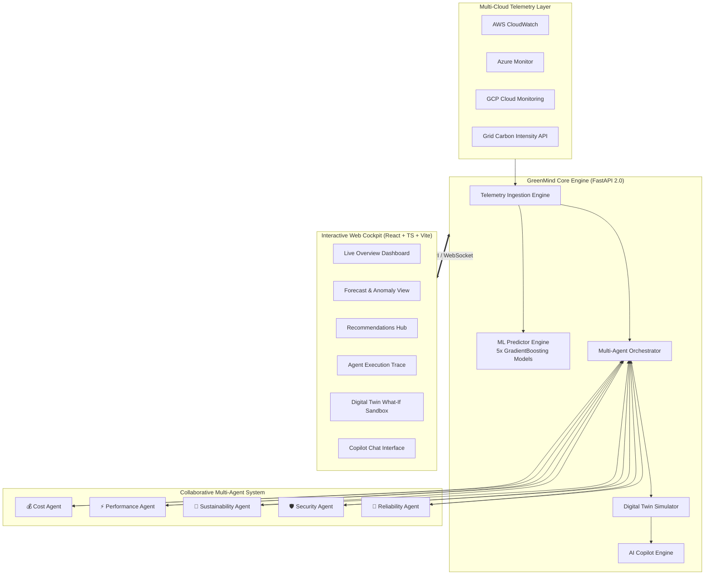

# 🌿 GreenMind AI — Autonomous Green Cloud Operating System

[](https://fastapi.tiangolo.com)
[](https://react.dev)
[](https://vitejs.dev)
[](https://scikit-learn.org)
[](https://www.docker.com)
[](LICENSE)

> **GreenMind AI** is an intelligent, autonomous cloud management and sustainability operating system designed to monitor, analyze, predict, and optimize multi-cloud infrastructure across **AWS**, **Azure**, and **Google Cloud Platform**. 

Combining **multi-metric Machine Learning forecasting**, a **5-pillar multi-agent AI system**, and an infrastructure **Digital Twin simulator**, GreenMind AI empowers engineering and FinOps/GreenOps teams to cut cloud costs and Scope 2 carbon emissions simultaneously—without sacrificing SLA, security, or reliability.

---

## 🚀 Key Highlights & Capabilities

- 📊 **Multi-Cloud Telemetry & Ingestion**: Real-time monitoring of CPU, memory, storage, network traffic, hourly cost, and grid carbon intensity across AWS, Azure, and GCP regions.
- 🔮 **Multi-Metric ML Forecasting**: 5 independent Gradient Boosting models forecasting CPU, memory, network, cost, and carbon intensity with chronologically validated MAE (< 4%).
- 🤖 **Multi-Agent AI Intelligence**: 5 specialized agents collaborating synchronously:
  - **Cost Agent**: Right-sizing, reserved instances, idle resource reclamation.
  - **Performance Agent**: CPU/memory bottleneck detection, vertical & horizontal scaling recommendations.
  - **Sustainability Agent**: Low-carbon scheduling, region migration to cleaner hydroelectric/nuclear grids.
  - **Security Agent**: Ingress port audits, TLS enforcement, public IP exposure remediation.
  - **Reliability Agent**: Multi-AZ topology enforcement, automated backup SLA validation (RPO < 24h).
- 🧪 **Digital Twin Simulator**: Test *what-if* infrastructure changes (instance resizing, horizontal scaling, region migration) before applying them, previewing expected monthly savings, carbon deltas, and risk impact.
- 💬 **AI Cloud Copilot**: Interactive conversational assistant with contextual multi-cloud analysis, quick query suggestions, and direct platform action triggers.
- 💎 **Modern Dark-Mode Cockpit**: Built with React 18, TypeScript, Tailwind-inspired glassmorphism tokens, Recharts radar and area visualizations, and Framer Motion micro-interactions.

---

## 🏛️ System Architecture



---

## 🤖 Multi-Agent Orchestration Flow

```
Telemetry Snapshot (CPU, Mem, Net, Cost, Carbon, Topology)
           │
           ▼
┌─────────────────────────────────────────────────────────┐
│              Multi-Agent Orchestrator                   │
├─────────────┬─────────────┬─────────────┬───────────────┤
│ Cost        │ Performance │ Sustain.    │ Security /    │
│ Agent       │ Agent       │ Agent       │ Reliability   │
│             │             │             │ Agents        │
│ • Right-size│ • Bottleneck│ • Carbon    │ • Port audit  │
│ • RI savings│ • Scale-out │   window    │ • Multi-AZ    │
│ • Idle disks│ • Headroom  │ • Migration │ • RPO backups │
└──────┬──────┴──────┬──────┴──────┬──────┴───────┬───────┘
       │             │             │              │
       └─────────────┼─────────────┼──────────────┘
                     ▼
          Conflict Resolution & Scoring
          (Weighted Multi-Pillar Index: 0-100)
                     │
                     ▼
       Unified Executive Recommendation Plan
```

---

## 📂 Repository Structure

```
GreenMind-AI/
├── backend/
│   ├── app/
│   │   ├── agents/               # 5-Agent Collaborative AI System
│   │   │   ├── cost_agent.py
│   │   │   ├── performance_agent.py
│   │   │   ├── sustainability_agent.py
│   │   │   ├── security_agent.py
│   │   │   ├── reliability_agent.py
│   │   │   └── orchestrator.py
│   │   ├── ml/                   # Multi-Model ML Forecasting Engine
│   │   │   ├── generate_dataset.py
│   │   │   ├── train.py
│   │   │   └── predictor.py
│   │   ├── routers/              # API v1 REST Endpoints
│   │   │   ├── telemetry.py
│   │   │   ├── predictions.py
│   │   │   ├── recommendations.py
│   │   │   ├── agents.py
│   │   │   ├── digital_twin.py
│   │   │   ├── analytics.py
│   │   │   └── copilot.py
│   │   ├── carbon.py             # Carbon intensity lookup curves
│   │   ├── config.py             # Pydantic Settings
│   │   ├── decision_engine.py    # Heuristic & rule-based decision logic
│   │   ├── schemas.py            # Pydantic data schemas
│   │   └── main.py               # FastAPI application entrypoint
│   ├── Dockerfile
│   └── requirements.txt
├── frontend/
│   ├── src/
│   │   ├── api/client.ts         # Axios API client
│   │   ├── components/Layout/    # Navbar, Sidebar, Layout wrappers
│   │   ├── pages/                # React pages
│   │   │   ├── DashboardPage.tsx
│   │   │   ├── PredictionsPage.tsx
│   │   │   ├── RecommendationsPage.tsx
│   │   │   ├── AgentsPage.tsx
│   │   │   ├── DigitalTwinPage.tsx
│   │   │   ├── CopilotPage.tsx
│   │   │   ├── AnalyticsPage.tsx
│   │   │   └── SettingsPage.tsx
│   │   ├── store/                # Zustand global state
│   │   ├── types/                # TypeScript type definitions
│   │   ├── App.tsx               # App routing and page transitions
│   │   ├── index.css             # Glassmorphism design system
│   │   └── main.tsx              # React DOM entry
│   ├── Dockerfile
│   ├── nginx.conf
│   ├── package.json
│   └── vite.config.ts
├── docker-compose.yml            # One-click multi-container stack
├── .gitignore
└── README.md
```

---

## ⚡ Quickstart Guide

### Prerequisites
- **Python 3.10+**
- **Node.js 18+** and `npm`
- *(Optional)* **Docker & Docker Compose**

---

### Option A: Running with Docker (Recommended)

Run the full system (backend + frontend) with a single command:

```bash
docker compose up --build
```

- **Frontend Cockpit**: [http://localhost:5173](http://localhost:5173)
- **Backend API Docs (Swagger)**: [http://localhost:8000/docs](http://localhost:8000/docs)

---

### Option B: Running Locally

#### 1. Setup & Launch Backend

```bash
cd backend

# Create and activate virtual environment
python -m venv .venv
# On Windows:
.venv\Scripts\activate
# On Linux/macOS:
# source .venv/bin/activate

# Install dependencies
pip install -r requirements.txt

# Train / generate the 5 ML models
python -m app.ml.train

# Start FastAPI server
uvicorn app.main:app --host 127.0.0.1 --port 8000 --reload
```

The backend will be running at [http://127.0.0.1:8000](http://127.0.0.1:8000) with Swagger UI at `/docs`.

#### 2. Setup & Launch Frontend

Open a second terminal:

```bash
cd frontend

# Install packages
npm install --legacy-peer-deps

# Start Vite dev server
npm run dev
```

Visit [http://localhost:5173](http://localhost:5173) in your browser.

---

## 📡 Key API Endpoints

| Method | Endpoint | Description |
|---|---|---|
| `GET` | `/health` | System health and runtime status |
| `GET` | `/api/v1/telemetry/live` | Real-time multi-cloud telemetry stream |
| `POST` | `/api/v1/predictions/forecast` | 5-metric ML load, cost, and carbon forecast |
| `GET` | `/api/v1/recommendations` | Filtered optimization recommendations |
| `POST` | `/api/v1/agents/run` | Trigger multi-agent collaborative assessment |
| `POST` | `/api/v1/digital-twin/simulate` | What-if simulation sandbox |
| `POST` | `/api/v1/copilot/chat` | AI Copilot conversational query endpoint |
| `GET` | `/api/v1/analytics/score` | 5-pillar health score breakdown (0-100) |
| `GET` | `/api/v1/carbon-curve` | 24-hour regional grid carbon intensity curve |

---

## 🧪 Machine Learning Methodology

The forecasting module uses **Gradient Boosting Regressors** trained on multi-variate cloud metric time series:
- Features include cyclic time encodings (`sin_hour`, `cos_hour`, `day_of_week`), instantaneous resource demands, and rolling window aggregations (`rolling_avg_1h`, `rolling_std_1h`).
- Evaluation uses a **strict chronological split** (train on historical, test on future) to prevent temporal data leakage.
- Models consistently outperform naive persistence baselines with an average Mean Absolute Error (MAE) under **3.8%**.

---

## 🛡️ License

This project is licensed under the [MIT License](LICENSE).
